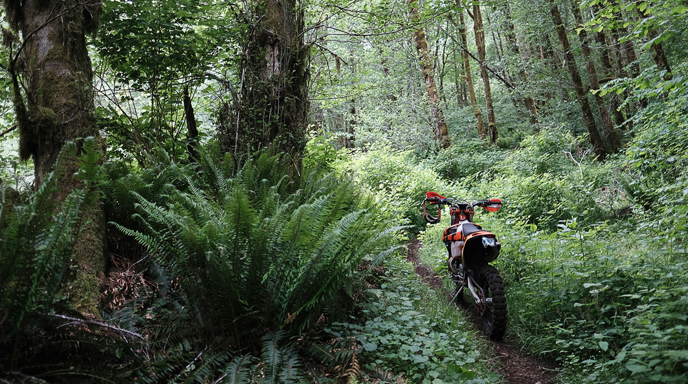
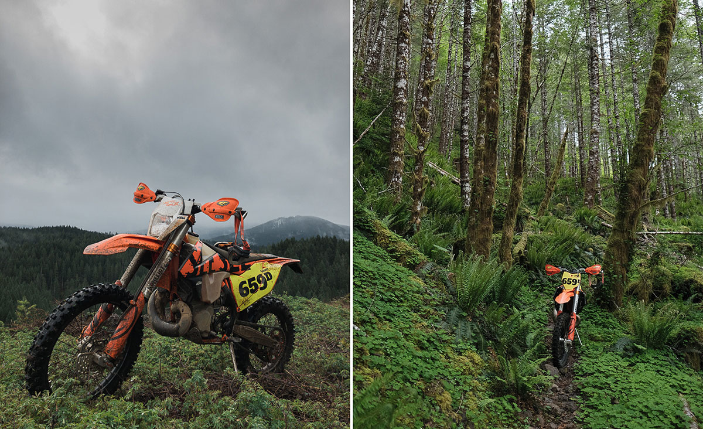
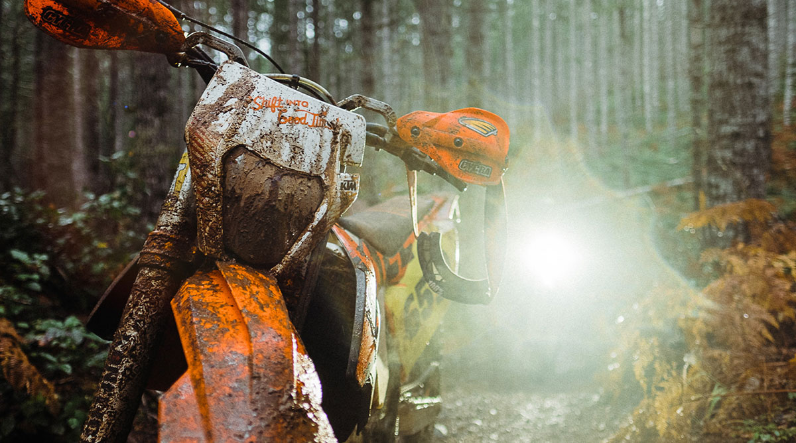
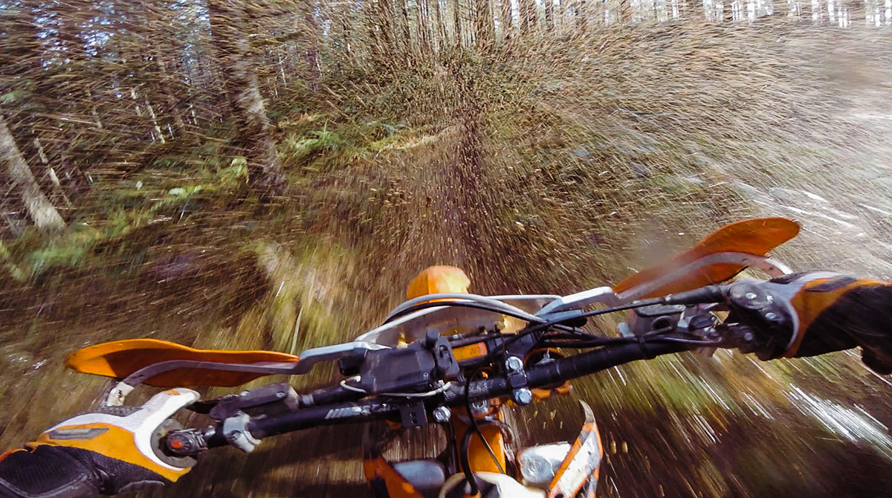
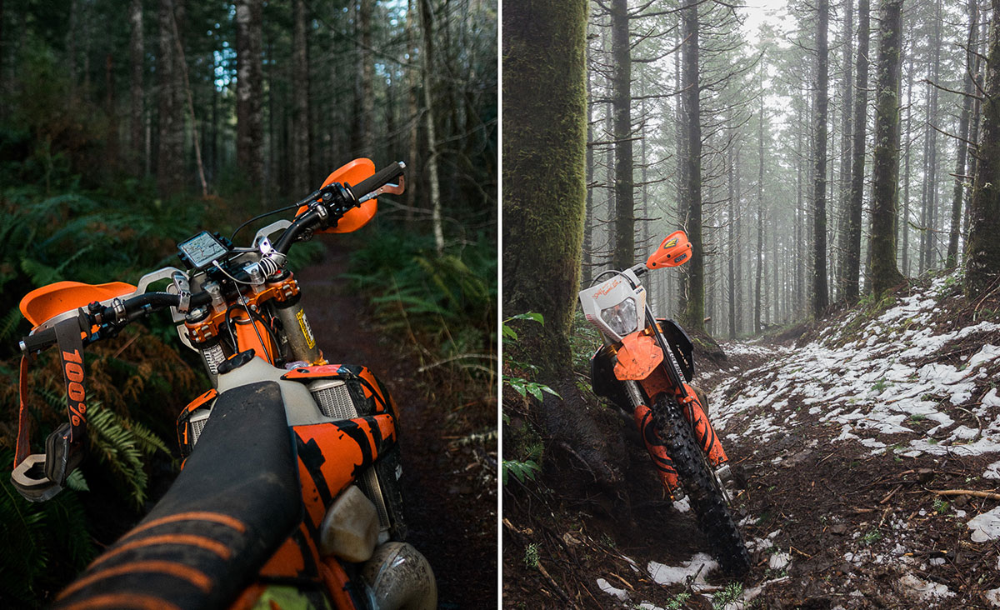
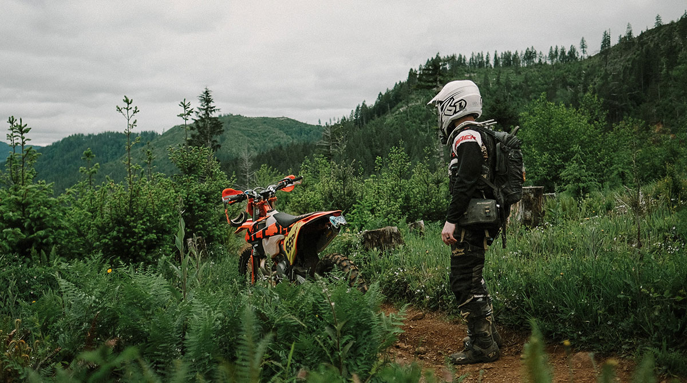
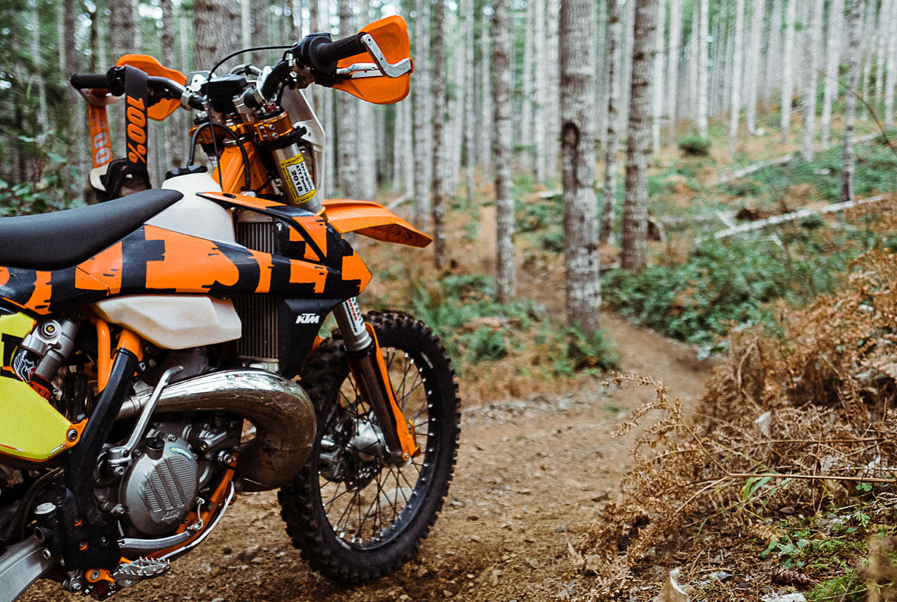

# D U A L S P O R T L I F E
### Garage Series, February 2018
- **Chris Hunt ([@huntca](https://www.instagram.com/huntca))**
- **Portland OR USA**
- **2017 KTM 300 XC-W Six Days**

### How long have you been riding and what got you started?

My first motorcycle was a 2008 Yamaha TW200 and I bought it new the same year. I was living in Seattle at the time and thought it would be a fun way to spice up my commute. It never saw dirt or an oil change, but lasted me 10k miles as my only vehicle before I sold it for a Harley Sportster, later a Triumph Bonneville, then Tiger 800, a Yamaha WR250R, and finally the 2017 KTM 300 XC-W that I ride today.

### What do you like most about the dual-sport lifestyle?

I was first attracted to trail riding because of how dang beautiful everything is once you get on a bike and ride for 15 minutes into the forest. It's completely silent and there's no signs, lights, garbage, or other people. It's also the only time I don't have internet access, which is kind of cool I think. The more I ride, the more I like this feeling and look for it. I get almost as much satisfaction from taking photos on the trails as I do from riding them.

### What mods have you done to the bike?

- [GoldenTyre GT216AA/GT216X Tires/G-Mousse](https://www.goldentyrewest.com)
- [See See KTM Racing Graphics](http://chrshnt.com/2kVTDhP)
- [Konflict Suspension](http://www.konflictmotorsports.com)
- [Slavens Mule HV Lectron Carburetor](http://chrshnt.com/2mTlouJ)
- [Rekluse Radius CX Clutch](http://chrshnt.com/2maAuKh)
- [FMF Turbine Core II Silencer](http://chrshnt.com/2k9hYOV)
- [FMF Gold Series "Gnarly Torque" Pipe](http://chrshnt.com/2majio9)
- [P3 Carbon Pipe Guard](http://chrshnt.com/2maBhed)
- [Midwest Mountain Engineering Clutch Lever](http://chrshnt.com/2gQiqQo)
- [V-Force 4R Reed](http://chrshnt.com/2qBdKrs)
- [Pro Pegs Titanium Footpegs Mud Version](http://chrshnt.com/2kVBn82)
- [Pro Pegs Titanium Rear Brake Lever Tip](http://chrshnt.com/2kVrU0H)
- [ODI V2 Emig MX Grips](http://chrshnt.com/2ByiQVT)
- [Hondo Garage Perfect Squeeze Phone Mount](http://chrshnt.com/2kWYwXU)
- [Hondo Garage Buzz-Kill Isolator](http://chrshnt.com/2kyUiGu)
- [Cycra HCM Mounts](http://chrshnt.com/2mbStQF)
- [Cycra ProBend Handguards](http://chrshnt.com/2qxU3Ro)
- [Enduro Engineering KTM Grab Handle ](http://chrshnt.com/2gc8Rw4)
- [Enduro Engineering Skid Plate](http://chrshnt.com/2g8bIoC)
- [Enduro Engineering Front Brake Disc Guard](http://chrshnt.com/2iUsy1m)
- [Enduro Engineering Rear Disc Guard](http://chrshnt.com/2geJFVO)
- [Bullet Proof Designs Radiator Guards](http://chrshnt.com/2k98KSL)

### What do you like about the bike?

I like the light weight (230lbs), low vibrations, easy/cheap maintenance, and comfortable suspension. It's the perfect bike for the challenging trails we have near home in Oregon. It also has a wide ratio transmission so it can hit highway speeds between trails. Although it doesn't ship from KTM 'street legal', it wasn't much work to get it ready and legal for the street. It's a great dualsport for folks who prefer the dirt.

### What do you not like about the bike?

It's a newer two stroke, so it doesn't like riding at steady speeds for long periods of time. On the road, I'll often find myself bouncing between 40 and 60 mph with out even trying because it's just what the bike wants to do. It's not ideal for lengthy adventure trips and I sometimes dream of having the slightly longer-legged KTM 500. I think the correct solution here is to just get a second bike, but I've always owned a single bike and like trying to make it work.

### Overall would you recommend the bike to other people?

Yes and I do all the time. I think the KTM 300 is one of the best bikes you can be riding when you're on the trails. The 2017 and later models are even more desirable because improvements to the engine have made the bike vibrate less than almost any other bike in the same category (like the four stroke 250, 350, 500).

